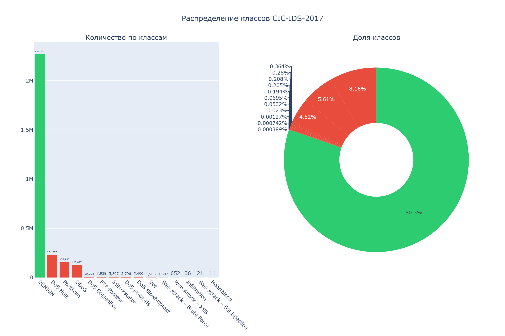
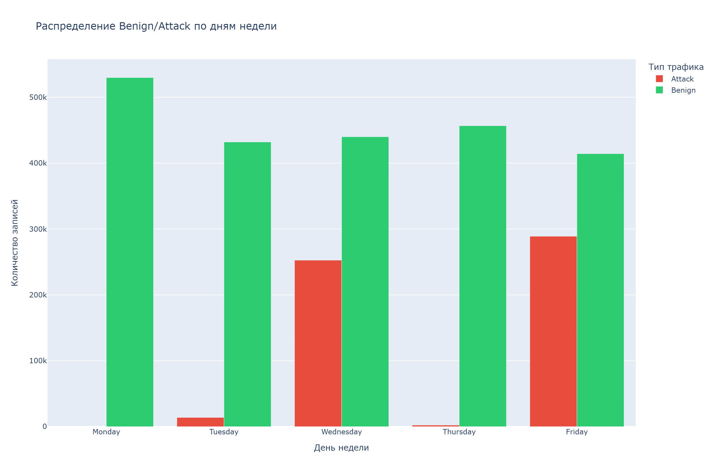
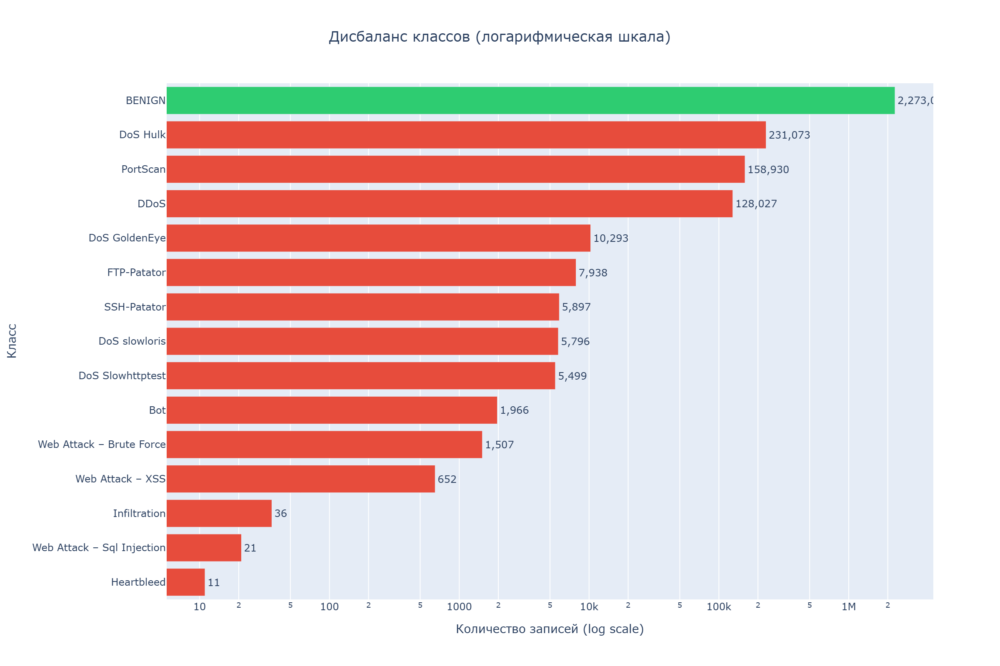
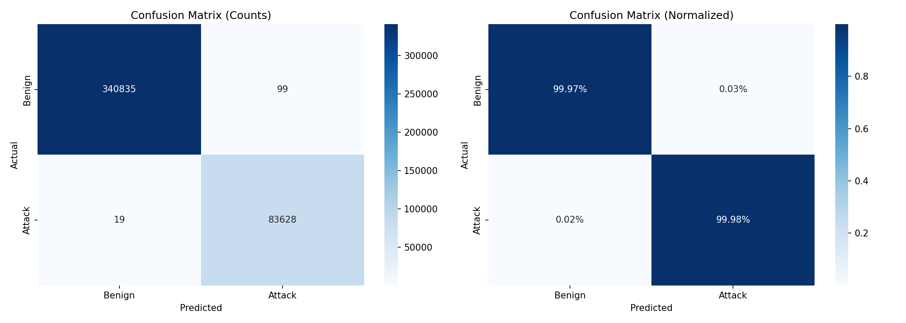
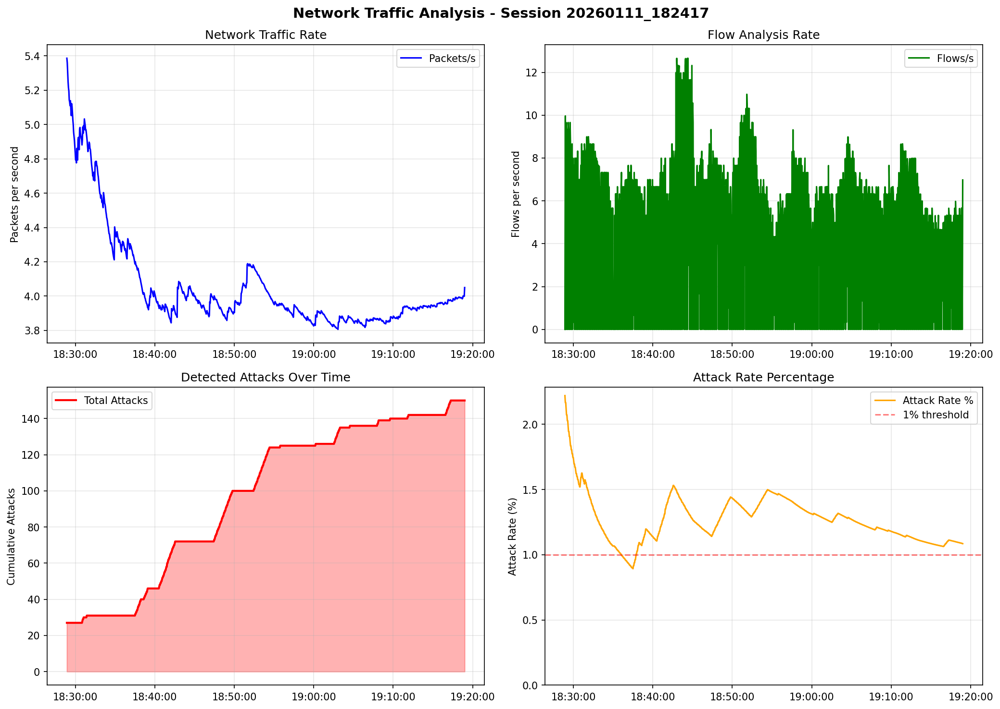
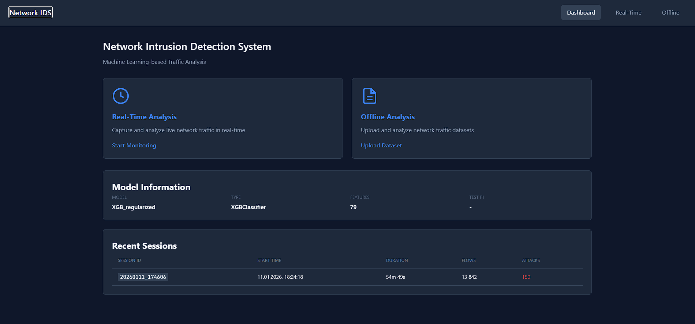
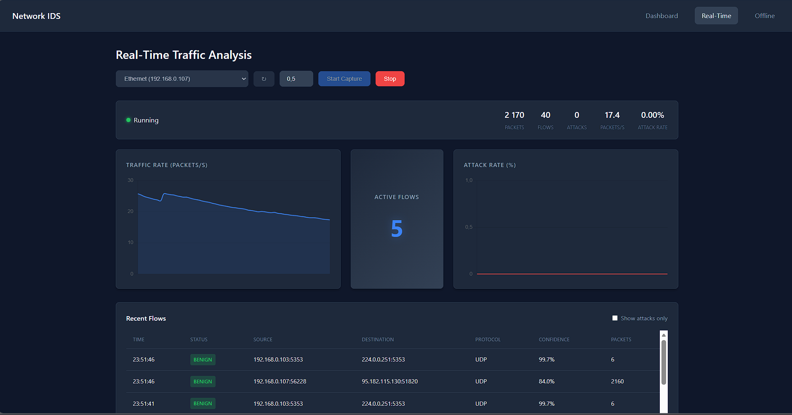
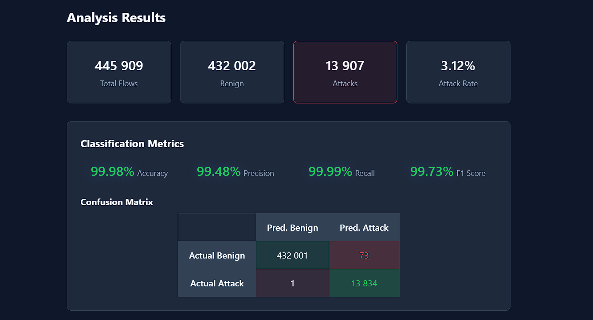

# Network Intrusion Detection System

A machine learning-based network intrusion detection system trained on the CIC-IDS-2017 dataset. This project implements a complete ML pipeline from raw data processing to model training, simulation, **real-time traffic analysis**, and **interactive web interface for monitoring and offline analysis**.


## Table of Contents

- [Overview](#overview)
- [Dataset](#dataset)
- [Project Structure](#project-structure)
- [Installation](#installation)
- [Data Pipeline](#data-pipeline)
- [Model Training](#model-training)
- [Results](#results)
- [Testing & Simulation](#testing--simulation)
- [Real-Time Traffic Analysis](#real-time-traffic-analysis)
- [Web Interface](#web-interface)
- [Usage](#usage)
- [References](#references)

---

## Overview

This project develops a binary classification system to detect malicious network traffic. The system distinguishes between benign traffic and various types of cyber attacks including DDoS, PortScan, Brute Force, and others.

### Key Features

- **Automated data pipeline**: Raw CSV ingestion, cleaning, preprocessing, and train/val/test splitting
- **Multiple model architectures**: Random Forest, XGBoost, LightGBM, Neural Networks
- **GPU-accelerated training**: CUDA support for XGBoost, LightGBM, and PyTorch
- **Ensemble methods**: Weighted soft voting across top-performing models
- **Comprehensive EDA**: Automated generation of visualizations and audit reports
- **Simulation pipeline**: Real-time flow replay with metrics collection and visualization
- **Real-time traffic analysis**: Live network packet capture and classification
- **Interactive Web Interface**: Dashboard for real-time monitoring and offline dataset analysis
- **End-to-end testing**: Unit tests and E2E tests for all pipeline components

---

## Dataset

### CIC-IDS-2017

The [CIC-IDS-2017](https://www.unb.ca/cic/datasets/ids-2017.html) dataset was created by the Canadian Institute for Cybersecurity. It contains labeled network flows captured over 5 days with both benign traffic and various attack types.

| Property | Value |
|----------|-------|
| Source | University of New Brunswick |
| Duration | 5 days (Monday-Friday) |
| Total Flows | 3,119,345 |
| Features | 79 (after preprocessing) |
| Attack Types | 14 |

### Attack Distribution

| Class | Count | Percentage |
|-------|-------|------------|
| BENIGN | 2,273,097 | 72.87% |
| DoS Hulk | 231,073 | 7.41% |
| PortScan | 158,930 | 5.09% |
| DDoS | 128,027 | 4.10% |
| DoS GoldenEye | 10,293 | 0.33% |
| FTP-Patator | 7,938 | 0.25% |
| SSH-Patator | 5,897 | 0.19% |
| DoS Slowloris | 5,796 | 0.19% |
| DoS Slowhttptest | 5,499 | 0.18% |
| Bot | 1,966 | 0.06% |
| Web Attack - Brute Force | 1,507 | 0.05% |
| Web Attack - XSS | 652 | 0.02% |
| Infiltration | 36 | <0.01% |
| Web Attack - SQL Injection | 21 | <0.01% |
| Heartbleed | 11 | <0.01% |

### Class Distribution Visualization



### Distribution by Day



### Class Imbalance (Log Scale)



---

## Project Structure

```
TraficAnalysis/
├── artifacts/                      # Trained preprocessors and schemas
│   ├── feature_schema.json         # Feature names and statistics
│   ├── label_mapping.json          # Class label encodings
│   └── preprocessor.joblib         # Fitted scaler (RobustScaler)
│
├── configs/                        # Configuration files
│   ├── data_pipeline.yaml          # Data processing parameters
│   ├── model_configs.yaml          # Model hyperparameters
│   └── simulation.yaml             # Simulation settings
│
├── data/
│   ├── raw/                        # Original CSV files
│   │   └── CICIDS-2017/TrafficLabelling/
│   ├── interim/                    # Intermediate processing
│   │   ├── bronze_combined.parquet
│   │   └── manifest.json
│   └── processed/                  # Final processed data
│       ├── processed_data.parquet
│       └── splits/
│           ├── train.parquet
│           ├── val.parquet
│           └── test.parquet
│
├── notebooks/
│   └── CIC_IDS_2017_model_training.ipynb
│
├── realtime/                       # Real-time analysis module
│   ├── __init__.py
│   ├── analyzer.py                 # ML model inference
│   ├── capture.py                  # Packet capture (scapy)
│   ├── config.py                   # Configuration management
│   ├── feature_extractor.py        # Flow feature extraction
│   ├── flow_aggregator.py          # Packet to flow aggregation
│   ├── pipeline.py                 # Main processing pipeline
│   ├── utils.py                    # Utilities and helpers
│   └── web_interface.py            # Flask/FastAPI integration
│
├── realtime_testing_artifacts/     # Real-time session results
│   └── YYYYMMDD_HHMMSS/
│       ├── flows.csv               # All analyzed flows
│       ├── attacks.csv             # Detected attacks only
│       ├── stats.json              # Session statistics
│       ├── session.log             # Attack log
│       ├── traffic_analysis.png    # Traffic charts
│       └── attack_analysis.png     # Attack breakdown
│
├── reports/
│   ├── figures/                    # EDA visualizations
│   └── simulation/                 # Simulation results
│
├── scripts/
│   ├── run_data_pipeline.py        # Data processing
│   ├── run_simulation.py           # Offline simulation
│   ├── run_realtime.py             # Real-time analyzer
│   ├── local_attack_test.py        # Attack simulation for testing
│   ├── run_e2e_test.py             # End-to-end tests
│   └── train_models.py             # Model training
│
├── src/                            # Source code
│   ├── data/                       # Data processing
│   ├── models/                     # Model implementations
│   ├── inference/                  # Inference pipeline
│   ├── simulation/                 # Simulation components
│   ├── database/                   # Database storage
│   └── visualization/              # Reporting and charts
│
├── tests/                          # Unit tests
│
├── training_artifacts/             # Trained models
│   ├── best_model_XGB_regularized.joblib
│   ├── confusion_matrix.png
│   ├── experiment_results.csv
│   └── feature_importance.csv
│
├── web/                            # Web interface
│   ├── app.py                      # Flask application factory
│   ├── routes/                     # Route handlers
│   │   ├── main.py                 # Dashboard
│   │   ├── realtime.py             # Real-time analysis
│   │   ├── offline.py              # Offline dataset analysis
│   │   └── api.py                  # REST API endpoints
│   ├── services/                   # Business logic
│   ├── templates/                  # HTML templates
│   ├── static/                     # CSS, JS, images
│   └── __init__.py
│
├── requirements.txt
└── LICENSE
```

### Key Components

| Directory/File | Description |
|----------------|-------------|
| `realtime/` | Real-time traffic analysis module |
| `realtime_testing_artifacts/` | Output from real-time analysis sessions |
| `scripts/run_realtime.py` | Main entry point for live traffic analysis |
| `scripts/local_attack_test.py` | Simulates attacks for testing the IDS |
| `src/inference/` | Model loading and batch prediction |
| `src/simulation/` | Offline flow replay and metrics |
| `web/` | Interactive web interface built with Flask, Chart.js, and SSE |

---

## Installation

### Requirements

- Python 3.12+
- 8GB+ RAM (16GB recommended)
- GPU with CUDA support (optional, for faster training)
- **Administrator/root privileges** (for packet capture)

### Setup

```bash
# Clone repository
git clone https://github.com/yourusername/TraficAnalysis.git
cd TraficAnalysis

# Create virtual environment
python -m venv .venv
source .venv/bin/activate  # Linux/Mac
# or
.venv\Scripts\activate     # Windows

# Install dependencies
pip install -r requirements.txt
```

### Windows-Specific Setup for Real-Time Analysis

Real-time packet capture on Windows requires **Npcap**:

1. **Download Npcap**: https://npcap.com/#download

2. **Install with WinPcap compatibility**:
   - Run the installer **as Administrator**
   - Check **"Install Npcap in WinPcap API-compatible Mode"**
   - Complete installation

3. **Install scapy**:
   ```powershell
   pip install scapy
   ```

4. **Verify installation**:
   ```powershell
   python -c "from scapy.all import get_if_list; print(get_if_list())"
   ```

### Linux Setup for Real-Time Analysis

```bash
# Install libpcap
sudo apt-get install libpcap-dev

# Install scapy
pip install scapy

# Grant capture permissions (alternative to running as root)
sudo setcap cap_net_raw,cap_net_admin=eip $(which python)
```

---

## Data Pipeline

The data pipeline transforms raw CSV files into model-ready datasets through the following stages:

### Pipeline Stages

```
Raw CSV → Bronze (merged) → Cleaned → Preprocessed → Train/Val/Test Splits
```

### Running the Pipeline

```bash
# Run complete pipeline
python scripts/run_data_pipeline.py

# Run specific steps
python scripts/run_data_pipeline.py --steps 1,2,3    # Manifest, ingest, EDA
python scripts/run_data_pipeline.py --steps 4,5      # Clean and split
```

### Processing Steps

| Step | Script | Description |
|------|--------|-------------|
| 1 | `01_manifest.py` | Create data manifest with file metadata |
| 2 | `02_ingest_bronze.py` | Merge CSVs into single Parquet file |
| 3 | `03_audit_eda.py` | Data quality audit and EDA visualizations |
| 4 | `04_build_processed.py` | Clean data and apply preprocessing |
| 5 | `05_make_splits.py` | Create stratified train/val/test splits |

### Data Cleaning

The cleaning process addresses known issues in CIC-IDS-2017:

| Issue | Solution |
|-------|----------|
| Missing values (NaN) | Median imputation |
| Infinite values | Replaced with NaN, then imputed |
| Duplicate rows | Removed (~9.3% of data) |
| Empty label rows | Removed (~9.25% of data) |
| Duplicate columns | `Fwd Header Length.1` removed |
| Outliers | Clipped to 0.1-99.9 percentile |

### Feature Scaling

- **Scaler**: RobustScaler (robust to outliers)
- **Features**: 79 numeric features retained
- **Dropped**: Flow ID, Source/Destination IP, Timestamp (to prevent data leakage)

### Data Splits

| Split | Rows | Benign | Attack | Strategy |
|-------|------|--------|--------|----------|
| Train | 1,981,378 | 80.3% | 19.7% | Stratified |
| Val | 424,581 | 80.3% | 19.7% | Stratified |
| Test | 424,581 | 80.3% | 19.7% | Stratified |

---

## Model Training

### Models Evaluated

| Model | Description | GPU Support |
|-------|-------------|-------------|
| Random Forest | Ensemble of decision trees | No |
| XGBoost | Gradient boosted trees | Yes (CUDA) |
| LightGBM | Light gradient boosting | Yes (GPU) |
| Neural Network | PyTorch MLP | Yes (CUDA) |

### Hyperparameter Configurations

#### XGBoost
```python
{
    "n_estimators": [100, 150, 200],
    "max_depth": [6, 8, 10],
    "learning_rate": [0.05, 0.1],
    "reg_alpha": [0, 0.1],
    "reg_lambda": [1.0],
    "scale_pos_weight": "auto"  # Handles class imbalance
}
```

#### LightGBM
```python
{
    "n_estimators": [100, 200, 300],
    "num_leaves": [15, 31, 63],
    "learning_rate": [0.05, 0.1, 0.15],
    "class_weight": "balanced"
}
```

#### Neural Network
```python
{
    "hidden_layers": [(64, 32), (128, 64, 32), (256, 128, 64)],
    "learning_rate": [0.0005, 0.001],
    "dropout": 0.3,
    "batch_size": 512,
    "max_epochs": 100
}
```

### Training Environment

Training was performed on Google Colab with:
- **GPU**: NVIDIA Tesla T4 (15GB VRAM)
- **RAM**: 12GB
- **Runtime**: ~15-25 minutes total

### Running Training

**Option 1: Google Colab (Recommended)**
1. Upload `splits.zip` and `artifacts.zip` to Google Drive
2. Open `notebooks/CIC_IDS_2017_model_training.ipynb` in Colab
3. Select GPU runtime: Runtime → Change runtime type → GPU
4. Run all cells

**Option 2: Local Training**
```bash
python scripts/train_models.py
```

---

## Results

### Model Comparison

| Model | Training Time | Val F1 | Val ROC-AUC | Test F1 | Test ROC-AUC |
|-------|---------------|--------|-------------|---------|--------------|
| **XGB_regularized** | 24.9s | **0.9993** | 0.9999 | **0.9994** | 0.9999 |
| XGB_deep | 28.1s | 0.9993 | 0.9999 | 0.9993 | 0.9999 |
| LGBM_deep | 60.3s | 0.9993 | 0.9999 | 0.9993 | 0.9999 |
| LGBM_baseline | 40.6s | 0.9992 | 0.9999 | 0.9991 | 0.9999 |
| LGBM_fast | 63.6s | 0.9989 | 0.9998 | 0.9988 | 0.9998 |
| RF_baseline | 522.7s | 0.9989 | 0.9999 | 0.9988 | 0.9999 |
| RF_deep | 320.8s | 0.9981 | 0.9999 | 0.9982 | 0.9999 |
| XGB_baseline | 21.9s | 0.9974 | 0.9999 | 0.9973 | 0.9999 |
| RF_wide | 563.1s | 0.9901 | 0.9998 | 0.9900 | 0.9998 |

### Best Model: XGB_regularized

```python
{
    "n_estimators": 150,
    "max_depth": 8,
    "learning_rate": 0.1,
    "reg_alpha": 0.1,
    "reg_lambda": 1.0
}
```
Hyperparameters:
- n_estimators: 150
- max_depth: 8
- learning_rate: 0.1
- reg_alpha: 0.1
- reg_lambda: 1.0


### Ensemble Performance

Top-5 models combined using weighted soft voting:

| Metric | Best Single Model | Ensemble | Difference |
|--------|-------------------|----------|------------|
| F1 | 0.9994 | 0.9994 | +0.0000 |
| ROC-AUC | 0.9999 | 0.9999 | +0.0000 |
| PR-AUC | 0.9999 | 0.9999 | +0.0000 |
| Precision | 0.9991 | 0.9992 | +0.0001 |
| Recall | 0.9997 | 0.9996 | -0.0001 |

### Confusion Matrix



### Classification Report

```
              precision    recall  f1-score   support

      Benign     1.0000    0.9998    0.9999    340985
      Attack     0.9992    0.9997    0.9994     83596

    accuracy                         0.9998    424581
   macro avg     0.9996    0.9997    0.9997    424581
weighted avg     0.9998    0.9998    0.9998    424581
```

### Top Feature Importance (XGBoost)

| Rank | Feature | Importance |
|------|---------|------------|
| 1 | Init_Win_bytes_forward | 0.142 |
| 2 | Bwd Packet Length Std | 0.089 |
| 3 | Flow IAT Std | 0.076 |
| 4 | Fwd IAT Total | 0.065 |
| 5 | Bwd Packet Length Mean | 0.058 |
| 6 | Flow Duration | 0.054 |
| 7 | Fwd Packet Length Max | 0.048 |
| 8 | Subflow Fwd Bytes | 0.041 |
| 9 | Packet Length Std | 0.038 |
| 10 | Average Packet Size | 0.035 |

### Note on High Accuracy

The CIC-IDS-2017 dataset is known to produce very high accuracy scores (99%+) across many studies. This is due to:

1. **Distinct attack signatures**: Generated attacks have uniform patterns
2. **Controlled environment**: All traffic from a single network
3. **Synthetic nature**: Attacks were generated using specific tools

These results are consistent with published literature but may not reflect real-world performance. For production systems, testing on diverse, real-world traffic is essential.

---

## Testing & Simulation

This project includes a comprehensive testing and simulation framework to validate the end-to-end pipeline before deployment.

### Running Tests

#### Unit Tests

```bash
# Unit tests
pytest tests/ -v
```

**Test Coverage:**

# End-to-end tests
python scripts/run_e2e_test.py


**E2E Test Components:**

| Test | Description | Validates |
|------|-------------|-----------|
| Model Loading | Load trained XGBoost model | Model file integrity |
| Data Loading | Load test parquet data | Data pipeline output |
| Single Inference | Predict one flow | Predictor functionality |
| Batch Inference | Predict 1000 flows | Batch processing |
| Inference Pipeline | Process 5 batches | Full pipeline integration |
| Metrics Collector | Aggregate statistics | Metrics calculation |
| Database Operations | CRUD operations | SQLite storage |
| No Data Loss | Verify flow counts | Pipeline integrity |

**Expected Output:**
```
======================================================================
E2E TEST SUITE
======================================================================

Running: Model Loading... PASSED (1.80s)
Running: Data Loading... PASSED (0.58s)
Running: Single Inference... PASSED (0.42s)
Running: Batch Inference... PASSED (0.48s)
Running: Inference Pipeline... PASSED (0.42s)
Running: Metrics Collector... PASSED (1.01s)
Running: Database Operations... PASSED (0.15s)
Running: No Data Loss... PASSED (0.45s)

======================================================================
SUMMARY
======================================================================
Passed: 8/8
Failed: 0/8

All tests passed!
```

### Flow Simulation

The simulation pipeline replays flows from the test dataset through the trained model, collecting real-time metrics.

#### Running Simulation

```bash
# Full test dataset simulation
python scripts/run_simulation.py

# Fast simulation with limits
python scripts/run_simulation.py --speed 5 --max-flows 50000

# Use validation set, skip database
python scripts/run_simulation.py --source val --no-db

# Quiet mode with custom output
python scripts/run_simulation.py --quiet --output results.json
```

#### Simulation Parameters

| Parameter | Default | Description |
|-----------|---------|-------------|
| `--source` | test | Data source: train, val, test |
| `--speed` | 1.0 | Replay speed multiplier |
| `--batch-size` | 100 | Flows per batch |
| `--max-flows` | None | Limit total flows |
| `--max-duration` | None | Limit time in seconds |
| `--no-db` | False | Skip database storage |
| `--no-viz` | False | Skip visualization generation |

### Simulation Results

| Metric | Value |
|--------|-------|
| Throughput | ~50,000 flows/sec |
| Latency p99 | 0.02ms |
| F1 Score | 0.9994 |
| False Positive Rate | 0.026% |

---

## Real-Time Traffic Analysis

### Overview

The real-time module captures live network traffic, extracts flow features compatible with CICIDS2017, and classifies each flow using the trained model.

### Module Components

| File | Description |
|------|-------------|
| `realtime/capture.py` | Packet capture using scapy, supports Windows (Npcap) and Linux |
| `realtime/flow_aggregator.py` | Aggregates packets into bidirectional flows with statistics |
| `realtime/feature_extractor.py` | Extracts 79 CICIDS2017-compatible features from flows |
| `realtime/analyzer.py` | Loads model and performs predictions |
| `realtime/pipeline.py` | Orchestrates the complete processing pipeline |
| `realtime/utils.py` | Logging, alerts, metrics collection |
| `realtime/config.py` | Configuration management |
| `realtime/web_interface.py` | REST API for web integration |

### Running Real-Time Analysis

**Prerequisites:**
- Administrator/root privileges
- Npcap installed (Windows) or libpcap (Linux)
- Trained model in `training_artifacts/`

**Basic Usage:**

```powershell
# Windows (Run PowerShell as Administrator)
python scripts/run_realtime.py -i "Беспроводная сеть" -v

# Linux (Run as root or with capabilities)
sudo python scripts/run_realtime.py -i eth0 -v
```

**Command Line Options:**

| Option | Description | Default |
|--------|-------------|---------|
| `-i, --interface` | Network interface name | Interactive selection |
| `-m, --model` | Path to model file | `training_artifacts/best_model_XGB_regularized.joblib` |
| `-t, --threshold` | Detection threshold | 0.5 |
| `-f, --filter` | BPF packet filter | `ip` |
| `-d, --duration` | Run duration in seconds | 0 (infinite) |
| `-v, --verbose` | Show all flows | False |
| `-q, --quiet` | Only show attacks | False |
| `-o, --output-dir` | Output directory | `realtime_testing_artifacts` |
| `--no-save` | Disable result saving | False |
| `--list-interfaces` | List available interfaces | - |

**Examples:**

```powershell
# List available network interfaces
python scripts/run_realtime.py --list-interfaces

# Run for 5 minutes with verbose output
python scripts/run_realtime.py -i "Ethernet" -v -d 300

# Run with lower threshold (more sensitive)
python scripts/run_realtime.py -i "Wi-Fi" -t 0.3 -v

# Capture only HTTP/HTTPS traffic
python scripts/run_realtime.py -i "Ethernet" -f "tcp port 80 or tcp port 443"

# Run without saving results
python scripts/run_realtime.py -i "Ethernet" --no-save
```

### Real-Time Output

**Console Output (Verbose Mode):**

```
======================================================================
       REAL-TIME NETWORK TRAFFIC ANALYZER
======================================================================

----------------------------------------------------------------------
  Interface: Беспроводная сеть
  Model: best_model_XGB_regularized.joblib
  Threshold: 0.5
  Output: realtime_testing_artifacts\20260111_182417
----------------------------------------------------------------------

Starting... (Ctrl+C to stop)

[OK] Capture running

TIME     STATUS    SOURCE                  DESTINATION             PROTO  CONF   PACKETS
18:24:25   BENIGN   192.168.0.102:52304 ->   150.171.28.11:443   TCP  82.0%    38pkts
18:24:25   BENIGN   192.168.0.102:59781 -> 185.199.111.133:443   TCP  82.0%    26pkts
18:24:25   ATTACK   192.168.0.102:60498 ->    172.66.44.77:443   TCP  87.3%    14pkts

======================================================================
    ATTACK DETECTED!
======================================================================
  Time:       2026-01-11T18:24:25.123456
  Source:     192.168.0.102:60498
  Target:     172.66.44.77:443
  Protocol:   TCP
  Confidence: 87.3%
  Traffic:    14 packets, 2048 bytes
======================================================================
```

**Summary Mode (Default):**

```
[  45s] Pkts:    1,234 | Flows:   156 | Attacks: 🚨3 |   27.4 pps
```

### Session Artifacts

Each session creates a timestamped folder in `realtime_testing_artifacts/`:

```
realtime_testing_artifacts/
└── 20260111_182417/
    ├── flows.csv              # All analyzed flows
    ├── attacks.csv            # Detected attacks only
    ├── stats.json             # Session statistics
    ├── session.log            # Attack log file
    ├── traffic_analysis.png   # Traffic charts
    └── attack_analysis.png    # Attack breakdown (if attacks detected)
```

**flows.csv Format:**

| Column | Description |
|--------|-------------|
| timestamp | Detection time |
| src_ip | Source IP address |
| src_port | Source port |
| dst_ip | Destination IP address |
| dst_port | Destination port |
| protocol | Protocol number (6=TCP, 17=UDP) |
| duration | Flow duration in seconds |
| packets | Total packets |
| bytes | Total bytes |
| prediction | Model prediction (0=benign, 1=attack) |
| class_name | BENIGN or ATTACK |
| confidence | Model confidence |
| is_attack | Boolean flag |

**stats.json Example:**

```json
{
  "session_id": "20260111_182417",
  "start_time": "2026-01-11T18:24:18.575942",
  "end_time": "2026-01-11T19:19:07.341739",
  "runtime_seconds": 3288.77,
  "total_packets": 13289,
  "total_flows": 13842,
  "total_attacks": 150,
  "attack_rate": 0.0108,
  "packets_per_second": 4.04,
  "pipeline_stats": {
    "packets_processed": 13288,
    "flows_analyzed": 13842,
    "attacks_detected": 150,
    "analysis_errors": 0
  },
  "analyzer_stats": {
    "total_predictions": 13842,
    "benign_count": 13692,
    "attack_count": 150,
    "model_loaded": true,
    "n_features": 79,
    "latency_p50_ms": 0.52,
    "latency_p95_ms": 0.99,
    "latency_p99_ms": 3.07
  }
}
```

### Traffic Analysis Charts

The analyzer automatically generates visualizations:



**Charts include:**
- **Network Traffic Rate**: Packets per second over time
- **Flow Analysis Rate**: Flows analyzed per second
- **Detected Attacks**: Cumulative attack count
- **Attack Rate**: Percentage of malicious flows

### Testing with Simulated Attacks

For testing the IDS without real attacks, use the attack simulation script:

```powershell
# Terminal 1: Start the analyzer
python scripts/run_realtime.py -i "Ethernet" -v

# Terminal 2: Run simulated attacks
python scripts/local_attack_test.py -a all
```

**Available Attack Types:**

| Attack | Description | Command |
|--------|-------------|---------|
| portscan | TCP port scanning | `-a portscan -c 500` |
| syn | SYN flood (many connections) | `-a syn -c 1000` |
| udp | UDP flood | `-a udp -c 1000` |
| http | HTTP request flood | `-a http -c 200` |
| slowloris | Slow HTTP attack | `-a slowloris -d 30` |
| brute | Brute force simulation | `-a brute -c 50` |
| all | All attacks sequentially | `-a all` |

**Example:**

```powershell
# Run all attack types
python scripts/local_attack_test.py -a all

# Port scan only
python scripts/local_attack_test.py -a portscan -c 200

# SYN flood to specific port
python scripts/local_attack_test.py -a syn -p 80 -c 500

# Attack a specific target
python scripts/local_attack_test.py -t 192.168.1.100 -a portscan
```

### Troubleshooting

| Issue | Solution |
|-------|----------|
| "No interfaces found" | Install Npcap with WinPcap API compatibility mode |
| "Permission denied" | Run as Administrator (Windows) or root (Linux) |
| "Model not found" | Check path in `-m` option, default expects `training_artifacts/` |
| "scapy import error" | Run `pip install scapy` |
| No packets captured | Check interface name, try `--list-interfaces` |
| All flows marked BENIGN | Model may need retraining on your traffic patterns |

### Performance Notes

| Metric | Typical Value |
|--------|---------------|
| Packet processing | 10,000+ packets/sec |
| Flow analysis latency | <1ms (p50), <3ms (p99) |
| Memory usage | ~200MB base + flow cache |
| CPU usage | 5-15% single core |

---
## Web Interface

The system includes an interactive web interface built with **Flask**, **HTML/CSS**, **JavaScript**, and **Chart.js** for:

* real-time monitoring (live capture + streaming updates),
* offline dataset analysis (batch inference + metrics),
* basic REST API access for integrations.

### Launching the Web Interface

#### Windows (PowerShell)

Run from the project root **in PowerShell as Administrator**, with the **virtual environment activated**:

```powershell
# 1) Activate venv
.\.venv\Scripts\Activate.ps1

# 2) Run the web server (recommended entry point)
python scripts/run_web.py --debug
```

Then open:

* `http://127.0.0.1:5000`

#### Linux/Mac

```bash
source .venv/bin/activate
python do.py
```

### Dashboard (`/`)

The home page provides a quick overview:

* **Model Information**: model name/type, number of features, reference metrics (e.g., test F1).
* **Recent Sessions**: past real-time runs with runtime, flow count, and attack count.
* Navigation to **Real-Time** and **Offline** pages.




### Real-Time Analysis (`/realtime`)

Live monitoring of network traffic:

* **Interface Selection**: pick a network interface from the detected list.
* **Threshold Control**: adjust detection sensitivity (default: `0.5`).
* **Live Stats Bar**:

  * packets, flows, attacks,
  * packets/sec,
  * attack rate (%).
* **Charts**:

  * traffic rate (packets/sec),
  * attack rate (%) over time.
* **Recent Flows Table**:

  * up to 50 latest flows,
  * optional “attacks only” filter,
  * includes source/destination, protocol, confidence, packet count.
* **Server-Sent Events (SSE)**: streaming updates without page refresh.

#### Online Example Result




### Offline Analysis (`/offline`)

Upload and analyze historical datasets:

* **File Upload**: supports `.csv` and `.parquet`.
* **Automatic Analysis**:

  * detects ground-truth labels if present,
  * applies the same preprocessing + model as training,
  * computes full classification metrics (precision/recall/F1/confusion matrix) when labels exist.
* **Results Visualization**:

  * summary cards (total flows, attack rate, benign vs attack counts),
  * probability distribution histogram,
  * classification metrics (if labels are available).
* **Progress Indicator**: shows completion percentage during analysis.

#### Offline Example Result



### API Endpoints

The web interface exposes a REST API for integration:

| Endpoint                | Description                                                   |
| ----------------------- | ------------------------------------------------------------- |
| `GET /api/model-info`   | Model name, type, feature count, and reference test metric(s) |
| `GET /api/sessions`     | Recent real-time analysis sessions                            |
| `GET /api/health`       | Health check                                                  |
| `POST /offline/analyze` | Start offline dataset analysis                                |
| `GET /offline/progress` | Poll analysis progress and results                            |

### Architecture

* **Backend**: Flask + blueprints (`main`, `realtime`, `offline`, `api`)
* **Frontend**: vanilla JS + Chart.js + SSE
* **State**: in-process global state objects for background tasks
* **Execution**: background threads for long-running offline analysis

---


## Usage

### Loading a Trained Model

```python
import joblib
import pandas as pd

# Load model
model = joblib.load("training_artifacts/best_model_XGB_regularized.joblib")

# Load preprocessor
preprocessor = joblib.load("artifacts/preprocessor.joblib")

# Load feature schema
import json
with open("artifacts/feature_schema.json") as f:
    schema = json.load(f)

feature_cols = schema["feature_columns"]

# Predict on new data
def predict(df):
    X = df[feature_cols].values
    X_scaled = preprocessor.transform(X)
    predictions = model.predict(X_scaled)
    probabilities = model.predict_proba(X_scaled)[:, 1]
    return predictions, probabilities
```

### Loading the Ensemble

```python
import json
import joblib
import numpy as np

# Load ensemble config
with open("training_artifacts/ensemble_config.json") as f:
    config = json.load(f)

# Load models
models = {}
for name in config["models"]:
    models[name] = joblib.load(f"training_artifacts/{name}.joblib")

weights = config["weights"]

# Ensemble prediction
def ensemble_predict(X):
    probas = []
    for model in models.values():
        probas.append(model.predict_proba(X))
    
    weighted_proba = np.zeros_like(probas[0])
    total_weight = sum(weights)
    
    for proba, weight in zip(probas, weights):
        weighted_proba += proba * (weight / total_weight)
    
    return np.argmax(weighted_proba, axis=1), weighted_proba[:, 1]
```

### Using the Inference Pipeline

```python
from src.inference import Predictor, InferencePipeline

# Initialize predictor
predictor = Predictor(
    model_path="training_artifacts/best_model_XGB_regularized.joblib",
    preprocessor_path="artifacts/preprocessor.joblib",
    feature_schema_path="artifacts/feature_schema.json",
    threshold=0.5
)
predictor.load()

# Create pipeline
pipeline = InferencePipeline(predictor)

# Process flows
alerts = pipeline.process_batch(
    features=X,
    flow_indices=list(range(len(X))),
    true_labels=y  # Optional
)

# Get statistics
stats = pipeline.get_stats()
print(f"F1: {stats['f1']:.4f}")
print(f"Alerts: {stats['total_alerts']}")
```

### Using Real-Time Pipeline Programmatically

```python
from realtime import RealtimePipeline

# Define callbacks
def on_attack(result):
    print(f"Attack from {result.src_ip}: {result.confidence:.1%}")

def on_flow(result):
    print(f"Flow: {result.src_ip} -> {result.dst_ip}")

# Create pipeline
pipeline = RealtimePipeline(
    interface="Ethernet",
    model_path="training_artifacts/best_model_XGB_regularized.joblib",
    preprocessor_path="artifacts/preprocessor.joblib",
    feature_schema_path="artifacts/feature_schema.json",
    threshold=0.5,
    on_attack_detected=on_attack,
    on_flow_analyzed=on_flow
)

# Start capture
pipeline.start()

# Run for 60 seconds
import time
time.sleep(60)

# Get results
stats = pipeline.get_stats()
attacks = pipeline.get_recent_attacks(10)

# Stop
pipeline.stop()
```

---

## References

### Dataset

```
Sharafaldin, I., Lashkari, A. H., & Ghorbani, A. A. (2018).
"Toward Generating a New Intrusion Detection Dataset and Intrusion Traffic Characterization"
International Conference on Information Systems Security and Privacy (ICISSP)
```

### Related Work

```
Panigrahi, R., & Borah, S. (2018).
"A detailed analysis of CICIDS2017 dataset for designing Intrusion Detection Systems"
International Journal of Engineering & Technology

Aksu, D., Ustebay, S., Aydin, M. A., & Atmaca, T. (2018).
"Intrusion Detection with Comparative Analysis of Supervised Learning Techniques"
International Symposium on Computer and Information Sciences (ISCIS)
```

### Dataset Download

- Official: https://www.unb.ca/cic/datasets/ids-2017.html
- Kaggle: https://www.kaggle.com/datasets/ciaboroghigiovanni/cicids2017

---

## License

This project is licensed under the MIT License - see the [LICENSE](LICENSE) file for details.

---

## Acknowledgments

- Canadian Institute for Cybersecurity (CIC) for the CIC-IDS-2017 dataset
- University of New Brunswick for dataset hosting and documentation