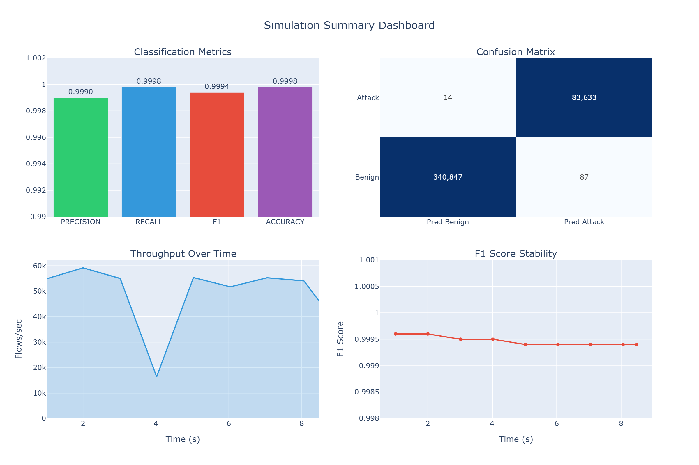
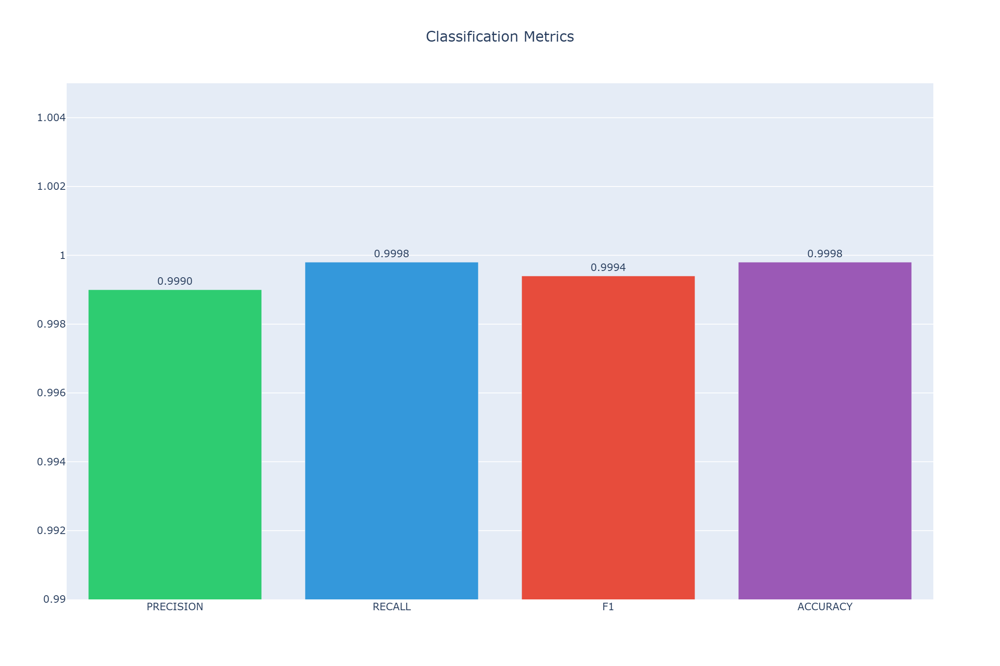
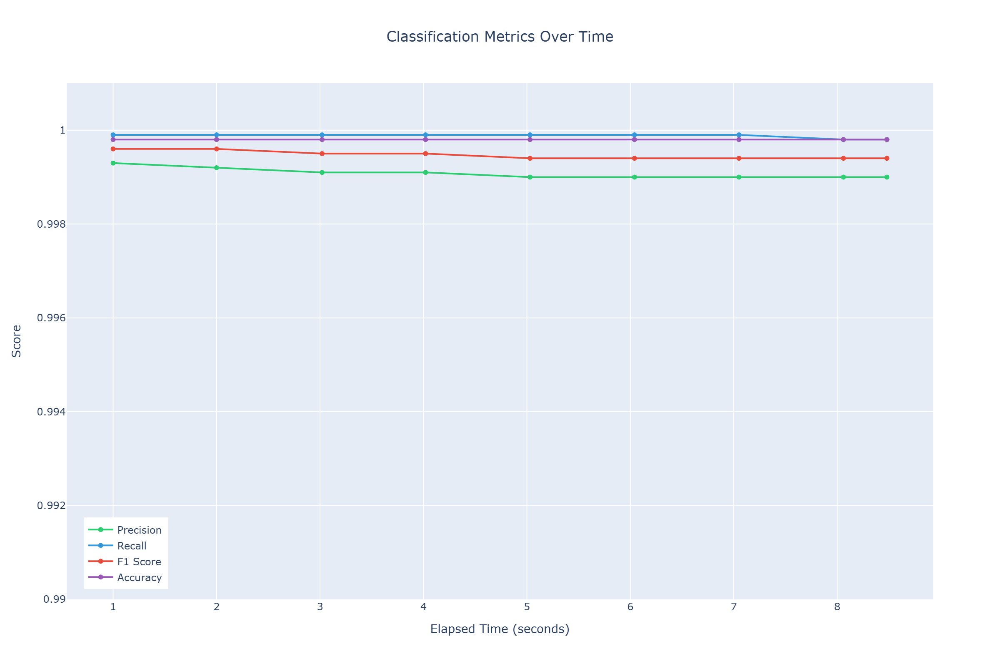
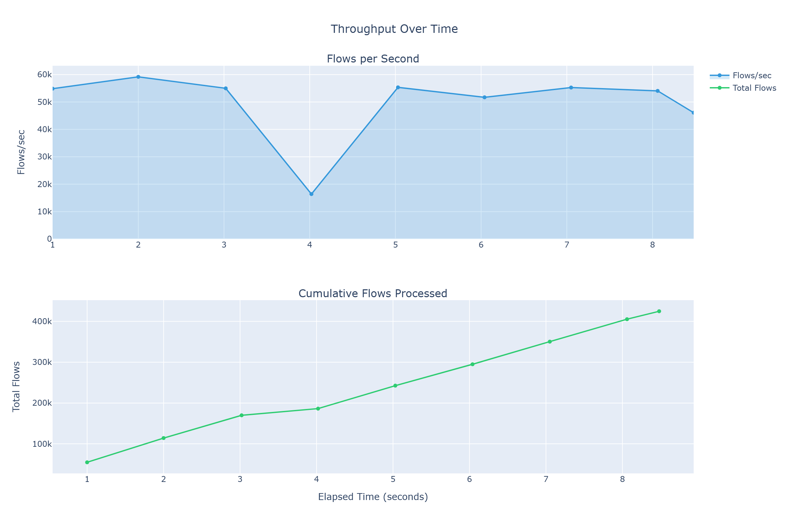
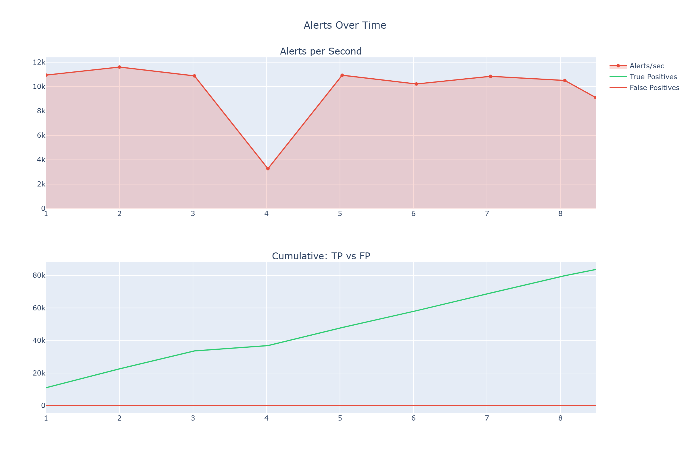

# Network Intrusion Detection System

A machine learning-based network intrusion detection system trained on the CIC-IDS-2017 dataset. This project implements a complete ML pipeline from raw data processing to model training and ensemble creation.


## Table of Contents

- [Overview](#overview)
- [Dataset](#dataset)
- [Project Structure](#project-structure)
- [Installation](#installation)
- [Data Pipeline](#data-pipeline)
- [Model Training](#model-training)
- [Results](#results)
- [Testing & Simulation](#testing--simulation)
- [Usage](#usage)
- [References](#references)

---

## Overview

This project develops a binary classification system to detect malicious network traffic. The system distinguishes between benign traffic and various types of cyber attacks including DDoS, PortScan, Brute Force, and others.

### Key Features

- **Automated data pipeline**: Raw CSV ingestion, cleaning, preprocessing, and train/val/test splitting
- **Multiple model architectures**: Random Forest, XGBoost, LightGBM, Neural Networks
- **GPU-accelerated training**: CUDA support for XGBoost, LightGBM, and PyTorch
- **Ensemble methods**: Weighted soft voting across top-performing models
- **Comprehensive EDA**: Automated generation of visualizations and audit reports
- **Simulation pipeline**: Real-time flow replay with metrics collection and visualization
- **End-to-end testing**: Unit tests and E2E tests for all pipeline components

---

## Dataset

### CIC-IDS-2017

The [CIC-IDS-2017](https://www.unb.ca/cic/datasets/ids-2017.html) dataset was created by the Canadian Institute for Cybersecurity. It contains labeled network flows captured over 5 days with both benign traffic and various attack types.

| Property | Value |
|----------|-------|
| Source | University of New Brunswick |
| Duration | 5 days (Monday-Friday) |
| Total Flows | 3,119,345 |
| Features | 79 (after preprocessing) |
| Attack Types | 14 |

### Attack Distribution

| Class | Count | Percentage |
|-------|-------|------------|
| BENIGN | 2,273,097 | 72.87% |
| DoS Hulk | 231,073 | 7.41% |
| PortScan | 158,930 | 5.09% |
| DDoS | 128,027 | 4.10% |
| DoS GoldenEye | 10,293 | 0.33% |
| FTP-Patator | 7,938 | 0.25% |
| SSH-Patator | 5,897 | 0.19% |
| DoS Slowloris | 5,796 | 0.19% |
| DoS Slowhttptest | 5,499 | 0.18% |
| Bot | 1,966 | 0.06% |
| Web Attack - Brute Force | 1,507 | 0.05% |
| Web Attack - XSS | 652 | 0.02% |
| Infiltration | 36 | <0.01% |
| Web Attack - SQL Injection | 21 | <0.01% |
| Heartbleed | 11 | <0.01% |

### Class Distribution Visualization


### Distribution by Day


### Class Imbalance (Log Scale)


---

## Project Structure

```
TraficAnalysis/
├── artifacts/                      # Trained preprocessors and schemas
│   ├── feature_schema.json         # Feature names and statistics
│   ├── label_mapping.json          # Class label encodings
│   └── preprocessor.joblib         # Fitted scaler (RobustScaler)
│
├── configs/                        # Configuration files
│   ├── data_pipeline.yaml          # Data processing parameters
│   ├── model_configs.yaml          # Model hyperparameters
│   └── simulation.yaml             # Simulation settings
│
├── data/
│   ├── raw/                        # Original CSV files
│   │   └── CICIDS-2017/TrafficLabelling/
│   │       ├── Monday-WorkingHours.pcap_ISCX.csv
│   │       ├── Tuesday-WorkingHours.pcap_ISCX.csv
│   │       └── ...
│   ├── interim/                    # Intermediate processing
│   │   ├── bronze_combined.parquet # Merged raw data
│   │   └── manifest.json           # Data manifest
│   └── processed/                  # Final processed data
│       ├── processed_data.parquet  # Cleaned dataset
│       └── splits/                 # Train/Val/Test splits
│           ├── train.parquet
│           ├── val.parquet
│           └── test.parquet
│
├── notebooks/
│   └── CIC_IDS_2017_model_training.ipynb  # Colab training notebook
│
├── reports/
│   ├── figures/                    # EDA visualizations
│   │   ├── 01_class_distribution.png
│   │   ├── 02_day_distribution.png
│   │   ├── 03_class_imbalance_log.png
│   │   ├── 04_correlation_matrix.png
│   │   └── 05_feature_distributions.png
│   ├── simulation/                 # Simulation results
│   │   ├── confusion_matrix_*.png
│   │   ├── dashboard_*.png
│   │   ├── metrics_timeline_*.png
│   │   ├── throughput_timeline_*.png
│   │   └── simulation_report_*.json
│   └── audit_report.json           # Data quality report
│
├── scripts/                        # Pipeline scripts
│   ├── run_data_pipeline.py        # Main data pipeline
│   ├── run_simulation.py           # Simulation runner
│   ├── run_e2e_test.py             # End-to-end tests
│   └── train_models.py             # Model training
│
├── src/                            # Source code
│   ├── data/                       # Data processing modules
│   │   ├── audit.py                # Data quality auditing
│   │   ├── build.py                # Cleaning and preprocessing
│   │   ├── common.py               # Utilities
│   │   ├── ingest.py               # Data loading
│   │   ├── manifest.py             # Manifest creation
│   │   └── splits.py               # Train/val/test splitting
│   ├── models/                     # Model implementations
│   │   ├── base.py                 # Base model class
│   │   ├── random_forest.py
│   │   ├── xgboost_model.py
│   │   ├── lightgbm_model.py
│   │   ├── neural_net.py
│   │   ├── ensemble.py             # Ensemble methods
│   │   └── metrics.py              # Evaluation metrics
│   ├── inference/                  # Inference pipeline
│   │   ├── predictor.py            # Model prediction
│   │   └── pipeline.py             # Full inference pipeline
│   ├── simulation/                 # Simulation components
│   │   ├── replay.py               # Flow replay from dataset
│   │   ├── runner.py               # Simulation orchestrator
│   │   └── metrics_collector.py    # Metrics aggregation
│   ├── database/                   # Database storage
│   │   ├── models.py               # SQLAlchemy ORM models
│   │   └── repository.py           # CRUD operations
│   └── visualization/              # Reporting and charts
│       └── reports.py              # Visualization generation
│
├── tests/                          # Unit tests
│   ├── test_inference.py
│   └── test_replay.py
│
├── training_artifacts/             # Trained models
│   ├── best_model_XGB_regularized.joblib
│   ├── confusion_matrix.png
│   ├── ensemble_config.json
│   ├── experiment_results.csv
│   └── feature_importance.csv
│
├── requirements.txt
└── LICENSE
```

### Key Files Description

| File/Directory | Description |
|----------------|-------------|
| `scripts/run_data_pipeline.py` | Main entry point for data processing pipeline |
| `scripts/run_simulation.py` | Flow simulation with metrics and visualization |
| `scripts/run_e2e_test.py` | End-to-end test suite |
| `configs/simulation.yaml` | Simulation configuration |
| `src/inference/*.py` | Model loading and prediction |
| `src/simulation/*.py` | Flow replay and metrics collection |
| `src/database/*.py` | SQLite storage for simulation results |
| `src/visualization/*.py` | Chart generation for reports |

---

## Installation

### Requirements

- Python 3.12+
- 8GB+ RAM (16GB recommended)
- GPU with CUDA support (optional, for faster training)

### Setup

```bash
# Clone repository
git clone https://github.com/yourusername/TraficAnalysis.git
cd TraficAnalysis

# Create virtual environment
python -m venv .venv
source .venv/bin/activate  # Linux/Mac
# or
.venv\Scripts\activate     # Windows

# Install dependencies
pip install -r requirements.txt
```

## Data Pipeline

The data pipeline transforms raw CSV files into model-ready datasets through the following stages:

### Pipeline Stages

```
Raw CSV → Bronze (merged) → Cleaned → Preprocessed → Train/Val/Test Splits
```

### Running the Pipeline

```bash
# Run complete pipeline
python scripts/run_data_pipeline.py

# Run specific steps
python scripts/run_data_pipeline.py --steps 1,2,3    # Manifest, ingest, EDA
python scripts/run_data_pipeline.py --steps 4,5      # Clean and split
```

### Processing Steps

| Step | Script | Description |
|------|--------|-------------|
| 1 | `01_manifest.py` | Create data manifest with file metadata |
| 2 | `02_ingest_bronze.py` | Merge CSVs into single Parquet file |
| 3 | `03_audit_eda.py` | Data quality audit and EDA visualizations |
| 4 | `04_build_processed.py` | Clean data and apply preprocessing |
| 5 | `05_make_splits.py` | Create stratified train/val/test splits |

### Data Cleaning

The cleaning process addresses known issues in CIC-IDS-2017:

| Issue | Solution |
|-------|----------|
| Missing values (NaN) | Median imputation |
| Infinite values | Replaced with NaN, then imputed |
| Duplicate rows | Removed (~9.3% of data) |
| Empty label rows | Removed (~9.25% of data) |
| Duplicate columns | `Fwd Header Length.1` removed |
| Outliers | Clipped to 0.1-99.9 percentile |

### Feature Scaling

- **Scaler**: RobustScaler (robust to outliers)
- **Features**: 79 numeric features retained
- **Dropped**: Flow ID, Source/Destination IP, Timestamp (to prevent data leakage)

### Data Splits

| Split | Rows | Benign | Attack | Strategy |
|-------|------|--------|--------|----------|
| Train | 1,981,378 | 80.3% | 19.7% | Stratified |
| Val | 424,581 | 80.3% | 19.7% | Stratified |
| Test | 424,581 | 80.3% | 19.7% | Stratified |

---

## Model Training

### Models Evaluated

| Model | Description | GPU Support |
|-------|-------------|-------------|
| Random Forest | Ensemble of decision trees | No |
| XGBoost | Gradient boosted trees | Yes (CUDA) |
| LightGBM | Light gradient boosting | Yes (GPU) |
| Neural Network | PyTorch MLP | Yes (CUDA) |

### Hyperparameter Configurations

#### XGBoost
```python
{
    "n_estimators": [100, 150, 200],
    "max_depth": [6, 8, 10],
    "learning_rate": [0.05, 0.1],
    "reg_alpha": [0, 0.1],
    "reg_lambda": [1.0],
    "scale_pos_weight": "auto"  # Handles class imbalance
}
```

#### LightGBM
```python
{
    "n_estimators": [100, 200, 300],
    "num_leaves": [15, 31, 63],
    "learning_rate": [0.05, 0.1, 0.15],
    "class_weight": "balanced"
}
```

#### Neural Network
```python
{
    "hidden_layers": [(64, 32), (128, 64, 32), (256, 128, 64)],
    "learning_rate": [0.0005, 0.001],
    "dropout": 0.3,
    "batch_size": 512,
    "max_epochs": 100
}
```

### Training Environment

Training was performed on Google Colab with:
- **GPU**: NVIDIA Tesla T4 (15GB VRAM)
- **RAM**: 12GB
- **Runtime**: ~15-25 minutes total

### Running Training

**Option 1: Google Colab (Recommended)**
1. Upload `splits.zip` and `artifacts.zip` to Google Drive
2. Open `notebooks/CIC_IDS_2017_model_training.ipynb` in Colab
3. Select GPU runtime: Runtime → Change runtime type → GPU
4. Run all cells

**Option 2: Local Training**
```bash
python scripts/train_models.py
```

---

## Results

### Model Comparison

| Model | Training Time | Val F1 | Val ROC-AUC | Test F1 | Test ROC-AUC |
|-------|---------------|--------|-------------|---------|--------------|
| **XGB_regularized** | 24.9s | **0.9993** | 0.9999 | **0.9994** | 0.9999 |
| XGB_deep | 28.1s | 0.9993 | 0.9999 | 0.9993 | 0.9999 |
| LGBM_deep | 60.3s | 0.9993 | 0.9999 | 0.9993 | 0.9999 |
| LGBM_baseline | 40.6s | 0.9992 | 0.9999 | 0.9991 | 0.9999 |
| LGBM_fast | 63.6s | 0.9989 | 0.9998 | 0.9988 | 0.9998 |
| RF_baseline | 522.7s | 0.9989 | 0.9999 | 0.9988 | 0.9999 |
| RF_deep | 320.8s | 0.9981 | 0.9999 | 0.9982 | 0.9999 |
| XGB_baseline | 21.9s | 0.9974 | 0.9999 | 0.9973 | 0.9999 |
| RF_wide | 563.1s | 0.9901 | 0.9998 | 0.9900 | 0.9998 |

### Best Model: XGB_regularized

```
Hyperparameters:
- n_estimators: 150
- max_depth: 8
- learning_rate: 0.1
- reg_alpha: 0.1
- reg_lambda: 1.0
```

### Ensemble Performance

Top-5 models combined using weighted soft voting:

| Metric | Best Single Model | Ensemble | Difference |
|--------|-------------------|----------|------------|
| F1 | 0.9994 | 0.9994 | +0.0000 |
| ROC-AUC | 0.9999 | 0.9999 | +0.0000 |
| PR-AUC | 0.9999 | 0.9999 | +0.0000 |
| Precision | 0.9991 | 0.9992 | +0.0001 |
| Recall | 0.9997 | 0.9996 | -0.0001 |

### Confusion Matrix


### Classification Report

```
              precision    recall  f1-score   support

      Benign     1.0000    0.9998    0.9999    340985
      Attack     0.9992    0.9997    0.9994     83596

    accuracy                         0.9998    424581
   macro avg     0.9996    0.9997    0.9997    424581
weighted avg     0.9998    0.9998    0.9998    424581
```

### Top Feature Importance (XGBoost)

| Rank | Feature | Importance |
|------|---------|------------|
| 1 | Init_Win_bytes_forward | 0.142 |
| 2 | Bwd Packet Length Std | 0.089 |
| 3 | Flow IAT Std | 0.076 |
| 4 | Fwd IAT Total | 0.065 |
| 5 | Bwd Packet Length Mean | 0.058 |
| 6 | Flow Duration | 0.054 |
| 7 | Fwd Packet Length Max | 0.048 |
| 8 | Subflow Fwd Bytes | 0.041 |
| 9 | Packet Length Std | 0.038 |
| 10 | Average Packet Size | 0.035 |

### Note on High Accuracy

The CIC-IDS-2017 dataset is known to produce very high accuracy scores (99%+) across many studies. This is due to:

1. **Distinct attack signatures**: Generated attacks have uniform patterns
2. **Controlled environment**: All traffic from a single network
3. **Synthetic nature**: Attacks were generated using specific tools

These results are consistent with published literature but may not reflect real-world performance. For production systems, testing on diverse, real-world traffic is essential.

---

## Testing & Simulation

This project includes a comprehensive testing and simulation framework to validate the end-to-end pipeline before deployment.

### Running Tests

#### Unit Tests

```bash
# Run all unit tests
pytest tests/ -v
```

**Test Coverage:**

| Test Module | Tests | Description |
|-------------|-------|-------------|
| `test_inference.py` | 6 | Model loading, single/batch prediction, pipeline |
| `test_replay.py` | 6 | Data loading, batching, iteration, attack sampling |

**Expected Output:**
```
tests/test_inference.py::TestPredictor::test_load PASSED
tests/test_inference.py::TestPredictor::test_predict_single PASSED
tests/test_inference.py::TestPredictor::test_predict_batch PASSED
tests/test_inference.py::TestInferencePipeline::test_process_flow PASSED
tests/test_inference.py::TestInferencePipeline::test_process_batch PASSED
tests/test_inference.py::TestInferencePipeline::test_metrics_calculation PASSED
tests/test_replay.py::TestFlowReplay::test_load PASSED
tests/test_replay.py::TestFlowReplay::test_get_batch PASSED
tests/test_replay.py::TestFlowReplay::test_iter_batches PASSED
tests/test_replay.py::TestFlowReplay::test_progress PASSED
tests/test_replay.py::TestFlowReplay::test_reset PASSED
tests/test_replay.py::TestFlowReplay::test_get_attack_samples PASSED

12 passed in 6.06s
```

#### End-to-End Tests

```bash
# Run E2E test suite
python scripts/run_e2e_test.py
```

**E2E Test Components:**

| Test | Description | Validates |
|------|-------------|-----------|
| Model Loading | Load trained XGBoost model | Model file integrity |
| Data Loading | Load test parquet data | Data pipeline output |
| Single Inference | Predict one flow | Predictor functionality |
| Batch Inference | Predict 1000 flows | Batch processing |
| Inference Pipeline | Process 5 batches | Full pipeline integration |
| Metrics Collector | Aggregate statistics | Metrics calculation |
| Database Operations | CRUD operations | SQLite storage |
| No Data Loss | Verify flow counts | Pipeline integrity |

**Expected Output:**
```
======================================================================
E2E TEST SUITE
======================================================================

Running: Model Loading... PASSED (1.80s)
Running: Data Loading... PASSED (0.58s)
Running: Single Inference... PASSED (0.42s)
Running: Batch Inference... PASSED (0.48s)
Running: Inference Pipeline... PASSED (0.42s)
Running: Metrics Collector... PASSED (1.01s)
Running: Database Operations... PASSED (0.15s)
Running: No Data Loss... PASSED (0.45s)

======================================================================
SUMMARY
======================================================================
Passed: 8/8
Failed: 0/8

All tests passed!
```

### Flow Simulation

The simulation pipeline replays flows from the test dataset through the trained model, collecting real-time metrics.

#### Running Simulation

```bash
# Full test dataset simulation
python scripts/run_simulation.py

# Fast simulation with limits
python scripts/run_simulation.py --speed 5 --max-flows 50000

# Use validation set, skip database
python scripts/run_simulation.py --source val --no-db

# Quiet mode with custom output
python scripts/run_simulation.py --quiet --output results.json
```

#### Simulation Parameters

| Parameter | Default | Description |
|-----------|---------|-------------|
| `--source` | test | Data source: train, val, test |
| `--speed` | 1.0 | Replay speed multiplier |
| `--batch-size` | 100 | Flows per batch |
| `--max-flows` | None | Limit total flows |
| `--max-duration` | None | Limit time in seconds |
| `--no-db` | False | Skip database storage |
| `--no-viz` | False | Skip visualization generation |

### Simulation Results

#### Full Test Dataset (424,581 flows)

```
======================================================================
SIMULATION COMPLETED
======================================================================

Summary:
  Total flows processed: 424,581
  Total alerts generated: 83,720
  Elapsed time: 8.56 seconds
  Throughput: 49,590 flows/sec

Classification Metrics:
  Precision: 0.9990
  Recall:    0.9998
  F1 Score:  0.9994
  Accuracy:  0.9998

Confusion Matrix:
                    Predicted
                    Benign      Attack
Actual Benign      340,847          87
Actual Attack           14      83,633

Latency (ms):
  p50: 0.01
  p95: 0.01
  p99: 0.02
  Max: 1.82
```

#### Performance Summary

| Metric | Value | Notes |
|--------|-------|-------|
| Throughput | ~50,000 flows/sec | Production-ready |
| Latency p99 | 0.02ms | Suitable for real-time |
| False Positives | 87 | 0.026% of benign traffic |
| False Negatives | 14 | 0.017% of attacks missed |
| Total Errors | 101 | 0.024% error rate |

### Simulation Visualizations

The simulation generates comprehensive visualizations saved to `reports/simulation/`:

#### Summary Dashboard

Combined view of all key metrics in a single dashboard:



#### Confusion Matrix

Detailed breakdown of predictions vs actual labels:


#### Classification Metrics

Bar chart comparing precision, recall, F1, and accuracy:



#### Metrics Over Time

Tracking precision, recall, and F1 as data streams through:



#### Throughput Over Time

Flows processed per second and cumulative count:



#### Alerts Over Time

Alert generation rate and TP/FP accumulation:



#### Latency Distribution

Inference latency percentiles over time:


### Real-Time Metrics Snapshots

The simulation captures periodic snapshots showing metrics evolution:

| Time (s) | Flows | Flows/sec | Alerts | F1 | Precision | Recall |
|----------|-------|-----------|--------|-----|-----------|--------|
| 1.0 | 54,900 | 54,868 | 10,956 | 0.9996 | 0.9993 | 0.9999 |
| 2.0 | 114,100 | 59,166 | 22,568 | 0.9996 | 0.9992 | 0.9999 |
| 3.0 | 169,900 | 54,992 | 33,614 | 0.9995 | 0.9991 | 0.9999 |
| 4.0 | 186,300 | 16,397 | 36,887 | 0.9995 | 0.9991 | 0.9999 |
| 5.0 | 242,500 | 55,347 | 47,995 | 0.9994 | 0.9990 | 0.9999 |
| 6.0 | 294,900 | 51,719 | 58,348 | 0.9994 | 0.9990 | 0.9999 |
| 7.0 | 350,300 | 55,264 | 69,222 | 0.9994 | 0.9990 | 0.9999 |
| 8.0 | 405,200 | 54,061 | 79,891 | 0.9994 | 0.9990 | 0.9998 |
| 8.5 | 424,581 | 46,088 | 83,720 | 0.9994 | 0.9990 | 0.9998 |

**Key Observations:**
- F1 score remains stable at ~0.9994 throughout the simulation
- Throughput averages ~50,000 flows/sec with occasional dips
- Precision and recall stay consistently high (>0.999)
- No degradation over time indicates model stability

### Generated Artifacts

Each simulation run produces:

| File | Description |
|------|-------------|
| `simulation_report_N.json` | Full metrics report |
| `simulation_report_N.txt` | Human-readable summary |
| `snapshots_N.json` | Time-series metrics data |
| `confusion_matrix_N.png` | Confusion matrix heatmap |
| `dashboard_N.png` | Combined dashboard |
| `metrics_timeline_N.png` | F1/Precision/Recall over time |
| `throughput_timeline_N.png` | Flows/sec over time |
| `alerts_timeline_N.png` | Alert generation over time |
| `latency_timeline_N.png` | Latency percentiles over time |
| `classification_metrics_N.png` | Metrics bar chart |

---

## Usage

### Loading a Trained Model

```python
import joblib
import pandas as pd

# Load model
model = joblib.load("training_artifacts/best_model_XGB_regularized.joblib")

# Load preprocessor
preprocessor = joblib.load("artifacts/preprocessor.joblib")

# Load feature schema
import json
with open("artifacts/feature_schema.json") as f:
    schema = json.load(f)

feature_cols = schema["feature_columns"]

# Predict on new data
def predict(df):
    X = df[feature_cols].values
    X_scaled = preprocessor["scaler"].transform(X)
    predictions = model.predict(X_scaled)
    probabilities = model.predict_proba(X_scaled)[:, 1]
    return predictions, probabilities
```

### Loading the Ensemble

```python
import json
import joblib
import numpy as np

# Load ensemble config
with open("training_artifacts/ensemble_config.json") as f:
    config = json.load(f)

# Load models
models = {}
for name in config["models"]:
    models[name] = joblib.load(f"training_artifacts/{name}.joblib")

weights = config["weights"]

# Ensemble prediction
def ensemble_predict(X):
    probas = []
    for model in models.values():
        probas.append(model.predict_proba(X))
    
    weighted_proba = np.zeros_like(probas[0])
    total_weight = sum(weights)
    
    for proba, weight in zip(probas, weights):
        weighted_proba += proba * (weight / total_weight)
    
    return np.argmax(weighted_proba, axis=1), weighted_proba[:, 1]
```

### Using the Inference Pipeline

```python
from src.inference import Predictor, InferencePipeline

# Initialize predictor
predictor = Predictor(
    model_path="training_artifacts/best_model_XGB_regularized.joblib",
    preprocessor_path="artifacts/preprocessor.joblib",
    feature_schema_path="artifacts/feature_schema.json",
    threshold=0.5
)
predictor.load()

# Create pipeline
pipeline = InferencePipeline(predictor)

# Process flows
alerts = pipeline.process_batch(
    features=X,
    flow_indices=list(range(len(X))),
    true_labels=y  # Optional, for evaluation
)

# Get statistics
stats = pipeline.get_stats()
print(f"F1: {stats['f1']:.4f}")
print(f"Alerts: {stats['total_alerts']}")
```

### Running a Simulation

```python
from src.inference import Predictor
from src.simulation import FlowReplay, SimulationRunner, SimulationConfig

# Setup
predictor = Predictor(...)
predictor.load()

replay = FlowReplay(
    data_path="data/processed/splits/test.parquet",
    feature_cols=feature_cols,
    batch_size=100
)
replay.load()

config = SimulationConfig(
    speed=5.0,
    max_flows=10000,
    verbose=True
)

# Run
runner = SimulationRunner(predictor, replay, config)
report = runner.run()

print(f"Processed: {report['summary']['total_flows']}")
print(f"F1: {report['classification']['f1']:.4f}")
```

---

## References

### Dataset

```
Sharafaldin, I., Lashkari, A. H., & Ghorbani, A. A. (2018).
"Toward Generating a New Intrusion Detection Dataset and Intrusion Traffic Characterization"
International Conference on Information Systems Security and Privacy (ICISSP)
```

### Related Work

```
Panigrahi, R., & Borah, S. (2018).
"A detailed analysis of CICIDS2017 dataset for designing Intrusion Detection Systems"
International Journal of Engineering & Technology

Aksu, D., Ustebay, S., Aydin, M. A., & Atmaca, T. (2018).
"Intrusion Detection with Comparative Analysis of Supervised Learning Techniques"
International Symposium on Computer and Information Sciences (ISCIS)
```

### Dataset Download

- Official: https://www.unb.ca/cic/datasets/ids-2017.html
- Kaggle: https://www.kaggle.com/datasets/ciaboroghigiovanni/cicids2017

---

## License

This project is licensed under the MIT License - see the [LICENSE](LICENSE) file for details.

---

## Acknowledgments

- Canadian Institute for Cybersecurity (CIC) for the CIC-IDS-2017 dataset
- University of New Brunswick for dataset hosting and documentation